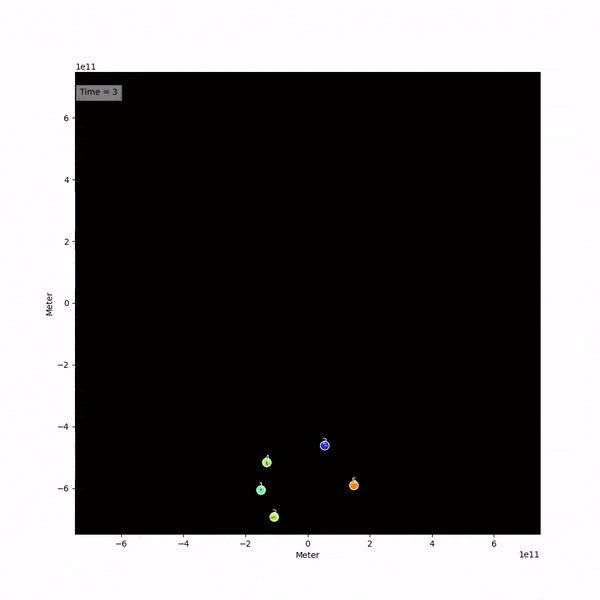

# :rocket: Plan A Trip To Mars :rocket:


[](https://github.com/flottflyt/plan-a-trip-to-mars/actions/workflows/installs.yml)



## Problems

### 1: Install the project

Getting used to programming collaboratively in python can be quite hard, as there are
lots of tooling options to choose from. Therefore, the first exercise is to just be able
to run the following command:

```console
$ plan-a-trip-to-mars
Hello, World!
This is plan-a-trip-to-mars, version 0.1.1
```

To do this, follow the [installation](#install) instructions below.

### 2: Editing the code

Let us try to make a change to the code. Open the file
`./src/plan_a_trip_to_mars/simulation.py`, and edit it such that the `Jerk` scenario is
being run.

### 3: Creating a new scenario

Open the file `./src/plan_a_trip_to_mars/scenarios.py`. The python class `BigScenario`
works as a template for all the other classes that _inherit_ it. Using the other classes
(`Simpl`, `Mayhem` and `Jerk`) as guiding, create a new class for a Mars orbit, for
example named `MarsTransfer`.

Figure out which methods (a function tied to a class) are needed for the new
`MarsTransfer` class to work.

As a starting point you should be able to run the simulation with three bodies: the Sun,
Earth and Mars. Their positions and velocities are not important yet, just make sure
they exist in the simulation.

### 4: Simulate the orbit of the Earth and Mars

Now, adjust the positions and velocities of the three bodies (Sun, Earth, Mars) so that
the Earth and Mars move in circular orbits around the Sun.

### 5: Estimate Mars opposition

Use the simulation to obtain a reasonable value for the amount of days between two Mars
oppositions, that is, the amount of days that passes between two occasions that Earth
and Mars are aligned with the Sun.

> [!TIP]
>
> The base class `BigScenario` has a method named `do_at_each_time_step()`. You may make
> use of this in order to get an estimate of the opposition time. Think about where the
> `do_at_each_time_step()` method should be implemented. Is it used by any other
> scenario class?

### 6: Calculate delta v

Calculate the velocity needed for a rocket to travel from Earth to Mars on a Hohmann
transfer orbit, i.e., the relative velocity with respect to Earth.

### 7: Simulate the transfer time

Using the program, obtain a reasonable number for the amount of days it takes for the
rocket to complete the transfer orbit, i.e., the amount of days until it arrives at
Mars. You should use your answer from
[problem 4](#4-simulate-the-orbit-of-the-earth-and-mars) to place the Earth and Mars in
a good position for the transfer orbit.

### 8: Calculate delta v

How much must the velocity of the rocket increase upon arrival at Mars if it were to
follow the same orbit? Give the rocket a `kick` on the day of arrival and confirm that
the rocket and Mars move as a pair.

### 9: Catching up with Mars

If the rocket missed on the timing of the transfer orbit, but is on Mars's orbit just
some distance behind, how would you adjust its velocity so that it overtakes Mars?
Explain.

### 10: Final

A rocket sits on a circular trajectory when a sudden impact in the radial direction
sends it on a parabolic trajectory. Find the velocity needed to get it on a parabolic
trajectory, and the closest point the parabolic trajectory will have to the centre
object. Simulate the path it takes.

## Install

The project is packaged with [Pixi] and [Uv], and additionally solved for [Conda]. All
three installation alternatives are available for all three major platforms: Linux, OSX
and Windows. You will need to use one of them to install this project.

### Uv

Uv is a python-only tool for handling your project, and extremely fast.

Install Uv via their [website](https://docs.astral.sh/uv/getting-started/installation/).

### Pixi

Pixi is similar to anaconda (just younger/more modern) and I have tested that it works
with for example Spyder.

Install Pixi via their [website](https://pixi.sh/latest/#installation).

### Conda

Conda has been around for a long time and has widespread support. The files that specify
the environments are generated using Pixi, as

```txt
environment.linux-64.yml
environment.osx-64.yml
environment.osx-arm64.yml
environment.win-64.yml
```

Install Conda via their
[website](https://docs.conda.io/projects/conda/en/stable/user-guide/install/index.html).

### Package `plan-a-trip-to-mars`

With one of the above tools installed (Uv/Pixi/Conda), you will now need to clone the
repository and `cd` into it. This is done using [git]. Alternatively, you may download
the repository in a zip-file from GitHub.

```bash
git clone https://github.com/flottflyt/plan-a-trip-to-mars.git
cd plan_a_trip_to_mars || exit
```

Now you can install the project with either Uv, Pixi or Conda:

```bash
# uv
uv sync
# pixi
pixi install
# conda (replace the file name to match your operating system platform)
conda env create --name name-of-my-env --file environment.linux-64.yml
```

## Running the code

You will now be able to run the python code! This can be done in two ways with slightly
different syntax depending on if you used Uv, Pixi or Conda to install the project.

```bash
# uv
uv run plan-a-trip-to-mars
uv run python ./src/plan_a_trip_to_mars/simulation.py
# pixi
pixi run -e spyder plan-a-trip-to-mars
pixi run -e spyder python ./src/plan_a_trip_to_mars/simulation.py
# conda
conda run -n name-of-my-env plan-a-trip-to-mars
conda run -n name-of-my-env python ./src/plan_a_trip_to_mars/simulation.py
```

> [!TIP]
>
> You can open the project in Spyder by running the following command in a terminal:
>
> ```bash
> pixi run -e spyder spyder
> ```

<details>
<summary>Note on virtual environments</summary>

When working on a python project, the best practice is to work inside a virtual
environment. This can be confusing to begin with, but the pros massively outweighs the
cons. Many programs exist that creates and manages virtual environments, and both Pixi
and Uv will do this automatically for you!

Many good alternatives for working with python using virtual environments exist. Pick
your favourite and learn how to use it.

</details>

## Usage

### Scenario constants

Five scenario constants exists, defined inside a single object `SimulationConstants`:

- `size`: The length of the sides of the simulation, in metres.
- `total_time`: The total time of the simulation, in units of `spi`. That is, changing
  the `spi` will change the unit of the total time (e.g. seconds to hours). This value
  decides how many iterations the simulation will use.
- `fps`: The frame rate of the animation. After the simulation has been calculated, only
  every `n`-th iteration is used (for `fps=n`). Useful if you need high temporal
  resolution, but a faster simulation.
- `time_scale`: The clock shown in the animation is divided by `time_scale`, effectively
  changing the time unit.
- `unit`: Add a time unit to the simulation clock.

### `Universe().set_spi()`

The `spi` decides how many seconds pass per iteration (seconds-per-iteration). By
default, everything is calculated using SI units, meaning seconds for time. This quickly
become computationally expensive when you want to simulate a solar system. Setting the
`spi` to `3600` will instead update all positions, velocities, etc. every hour. Be
careful to also change the timing of events; the time of a rocket's `kick` is now
specified in hours.

[conda]: https://docs.conda.io/en/latest/index.html
[git]: https://git-scm.com/
[pixi]: https://pixi.sh/latest/
[uv]: https://docs.astral.sh/uv/
